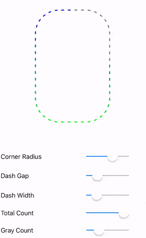
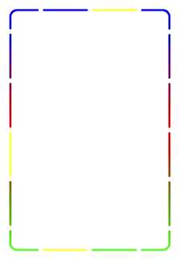

[](https://travis-ci.org/yulingtianxia/YXYDashLayer)
[](http://cocoapods.org/pods/YXYDashLayer)
[](https://github.com/Carthage/Carthage)
[](http://cocoapods.org/pods/YXYDashLayer)
[](http://cocoapods.org/pods/YXYDashLayer)
[](http://cocoapods.org/pods/YXYDashLayer)
[](http://cocoapods.org/pods/YXYDashLayer)
[](https://twitter.com/yulingtianxia)

# YXYDashLayer

`YXYProgressDashLayer` is composed of `YXYColorfulDashLayer`, which is masked by `YXYMaskDashLayer`. They can draw dash rounded rects.

`YXYMaskDashLayer` controls the dash path. `YXYColorfulDashLayer` is a subclass of `CAGradientLayer`, so it can draw colorful dash path. `YXYProgressDashLayer` uses two instances of `YXYColorfulDashLayer`.

## 📚 Article

[Colorful Rounded Rect Dash Border](http://yulingtianxia.com/blog/2018/04/30/Colorful-Rounded-Rect-Dash-Border/)

## 🐒 Usage



```
self.progressDash = [YXYProgressDashLayer layer];
self.progressDash.underLayer.colors = @[(id)[UIColor blueColor].CGColor, (id)[UIColor greenColor].CGColor];
self.progressDash.progressColor = [UIColor grayColor];

CGFloat radius = self.cornerRadiusSlider.value;
self.progressDash.dashCornerRadius = radius;

CGFloat dashGap = self.dashGapSlider.value;
self.progressDash.dashGap = dashGap;

CGFloat dashWidth = self.dashWidthSlider.value;
self.progressDash.dashWidth = dashWidth;

NSInteger count = self.totalCountSlider.value;
self.progressDash.totalCount = count;

self.progressDash.progress = self.grayCountSlider.value;

CGRect dashRect = CGRectMake((self.view.frame.size.width - 200) / 2, 50, 200, 300);
self.progressDash.frame = dashRect;
[self.progressDash refresh];
[self.view.layer addSublayer:self.progressDash];
```

For better performance, you can use `refreshProgress` after modifying `totalCount`、`dashGap` and `progress`. NOTE: `refresh` must be called when `frame`, `dashWidth` or `dashCornerRadius` changes.



```
CGRect dashRect = CGRectMake((self.view.frame.size.width - 200) / 2, 50, 200, 300);
YXYColorfulDashLayer *layer1 = [YXYColorfulDashLayer layer];
layer1.colors = @[(id)[UIColor blueColor].CGColor, (id)[UIColor redColor].CGColor, (id)[UIColor greenColor].CGColor];
layer1.totalCount = 16;
layer1.dashCornerRadius = 10;
layer1.showIndexes = @[@4, @1, @2, @3, @5, @6, @7, @9, @10, @12, @13, @14, @15];
layer1.frame = dashRect;
[layer1 refresh];
    
YXYColorfulDashLayer *layer2 = [YXYColorfulDashLayer layer];
layer2.colors = @[(id)[UIColor yellowColor].CGColor, (id)[UIColor yellowColor].CGColor];
layer2.totalCount = 16;
layer2.dashCornerRadius = 10;
layer2.showIndexes = @[@0, @8, @11];
layer2.frame = dashRect;
[layer2 refresh];
    
[self.view.layer addSublayer:layer1];
[self.view.layer addSublayer:layer2];
```

## 🔮 Example

To run the example project, clone the repo and run YXYDashLayerSample target.

## 💰 Requirement

- iOS 4.0+ 
- Xcode 9.0+

## 📲 Installation

### CocoaPods

[CocoaPods](http://cocoapods.org) is a dependency manager for Cocoa projects. You can install it with the following command:

```bash
$ gem install cocoapods
```

To integrate YXYDashLayer into your Xcode project using CocoaPods, specify it in your `Podfile`:


```
source 'https://github.com/CocoaPods/Specs.git'
platform :ios, '11.0'
use_frameworks!
target 'MyApp' do
	pod 'YXYDashLayer'
end
```

You need replace "MyApp" with your project's name.

Then, run the following command:

```bash
$ pod install
```

### Carthage

[Carthage](https://github.com/Carthage/Carthage) is a decentralized dependency manager that builds your dependencies and provides you with binary frameworks.

You can install Carthage with [Homebrew](http://brew.sh/) using the following command:

```bash
$ brew update
$ brew install carthage
```

To integrate YXYDashLayer into your Xcode project using Carthage, specify it in your `Cartfile`:

```ogdl
github "yulingtianxia/YXYDashLayer"
```

Run `carthage update` to build the framework and drag the built `YXYDashLayerKit.framework` into your Xcode project.

### Manual

Just drag the "Source" document folder into your project.

## ❤️ Contributed

- If you **need help** or you'd like to **ask a general question**, open an issue.
- If you **found a bug**, open an issue.
- If you **have a feature request**, open an issue.
- If you **want to contribute**, submit a pull request.

## 👨🏻‍💻 Author

yulingtianxia, yulingtianxia@gmail.com

## 👮🏻 License

YXYDashLayer is available under the MIT license. See the LICENSE file for more info.

